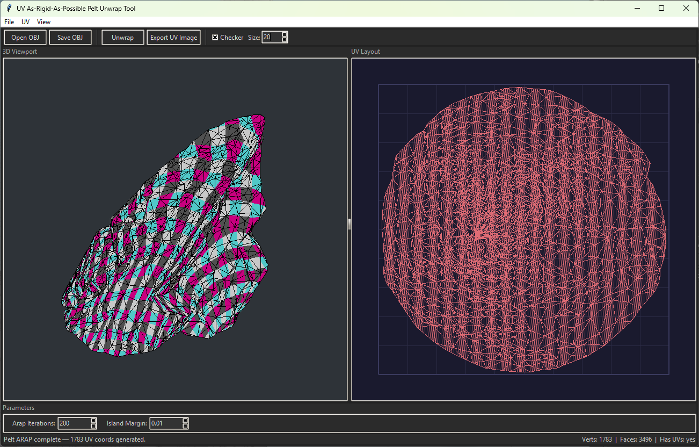

# ARAP Pelt UV Unwrap

A standalone Python tool for UV unwrapping 3D `.obj` meshes using **As-Rigid-As-Possible (ARAP)** parameterization. Built with Tkinter, it provides a full GUI with a real-time 3D OpenGL viewport and a 2D UV layout preview — no DCC application required.

Optimized for **rocks, cliffs, and natural environment assets** where uniform texel density across organic, high-curvature surfaces matters most.




## Features

- **ARAP Pelt Unwrap** — single-island unwrap with free-boundary ARAP iterations, the gold standard for minimizing stretch distortion
- **Automatic seam placement** — curvature-weighted geodesic seams that follow crevices and sharp edges (ideal for rocks/cliffs)
- **Real-time 3D viewport** — OpenGL-powered orbit/pan/zoom with checker texture overlay to visualize UV density
- **2D UV layout** — color-coded island view with grid overlay
- **Preserves original normals** — export only adds UV data, never overwrites your vertex normals
- **UV image export** — export the UV wireframe layout as a PNG (2048×2048)
- **Pure Python** — no compiled extensions, runs anywhere Python + pip works

## Use Cases

- **Game environment art** — unwrap rock, cliff, and terrain meshes for tiling textures
- **Photogrammetry cleanup** — re-unwrap scanned meshes that have poor or no UVs
- **Batch pipeline integration** — `pelt_unwrap()` can be called directly from scripts without the GUI
- **Learning tool** — study ARAP parameterization with a readable, well-commented implementation

## Installation

```bash
pip install -r requirements.txt
```

### Requirements

- Python 3.8+
- numpy
- scipy
- PyOpenGL
- pyopengltk
- Pillow

## Usage

### GUI

```bash
python main.py
```

1. **Open** an `.obj` mesh (`Ctrl+O`)
2. Adjust **ARAP Iterations** (default 50 — higher = more even UVs) and **Island Margin**
3. Click **Unwrap**
4. Inspect the result with the **checker texture** toggle and adjust the checker **Size**
5. **Save** the unwrapped `.obj` (`Ctrl+S`) or **Export UV Image** as PNG

### Script / Pipeline

```python
from mesh import load_obj, save_obj
from uv_algorithms import pelt_unwrap

mesh = load_obj("rock.obj")
pelt_unwrap(mesh, arap_iterations=50, island_margin=0.01)
save_obj("rock_uv.obj", mesh)
```

## Algorithm Pipeline

1. **Build local mesh** — re-index vertices for the unwrap solver
2. **Auto-seam** (closed meshes) — find a geodesic cycle using curvature-weighted Dijkstra so seams follow natural crevices rather than cutting across flat surfaces
3. **Initial flattening** — cotangent-Laplacian harmonic map with boundary vertices pinned to a circle
4. **ARAP iterations** — local/global alternation with:
   - Vectorized per-triangle SVD for best-fit rotations (local step)
   - Pre-factored sparse Cholesky solve (global step)
   - Free boundary — the boundary is not pinned, allowing the solver to find the lowest-distortion layout
5. **Normalize** — fit UVs into `[0, 1]` space with configurable margin

## Parameters

| Parameter | Range | Default | Description |
|---|---|---|---|
| `arap_iterations` | 1–200 | 50 | Number of ARAP local/global iterations. More = lower distortion, diminishing returns past ~80. |
| `island_margin` | 0.0–0.05 | 0.01 | Padding around the UV island in normalized UV space. |

## Project Structure

```
├── main.py             # Tkinter GUI application
├── mesh.py             # Mesh data structure and OBJ I/O
├── uv_algorithms.py    # ARAP Pelt unwrap algorithm
├── viewer3d.py         # OpenGL 3D viewport widget
└── requirements.txt    # Python dependencies

```

## Academic References

The algorithm is an original implementation based on these published methods:

- **Olga Sorkine & Marc Alexa**, *"As-Rigid-As-Possible Surface Modeling"*, Symposium on Geometry Processing (SGP), 2007.
  — The core ARAP formulation: local/global alternation with cotangent weights and per-triangle SVD rotations.

- **Takeo Igarashi, Tomer Moscovich, John F. Hughes**, *"As-Rigid-As-Possible Shape Manipulation"*, ACM Transactions on Graphics, 2005.
  — Earlier formulation of rigid-as-possible deformation.

- **Bruno Lévy, Sylvain Petitjean, Nicolas Ray & Jérome Maillot**, *"Least Squares Conformal Maps for Automatic Texture Atlas Generation"*, ACM SIGGRAPH, 2002.
  — Cotangent-Laplacian formulation used for the initial harmonic map.

## License

MIT License — see [LICENSE](LICENSE) for details.
